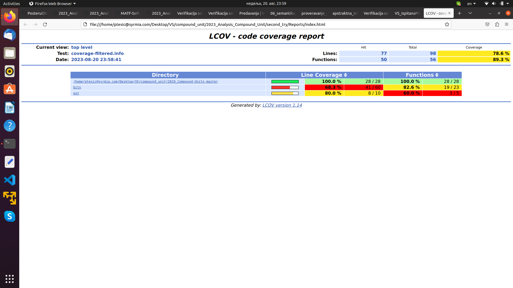
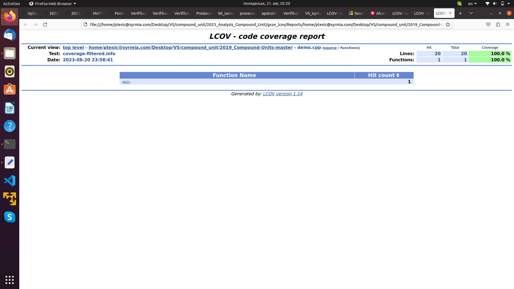
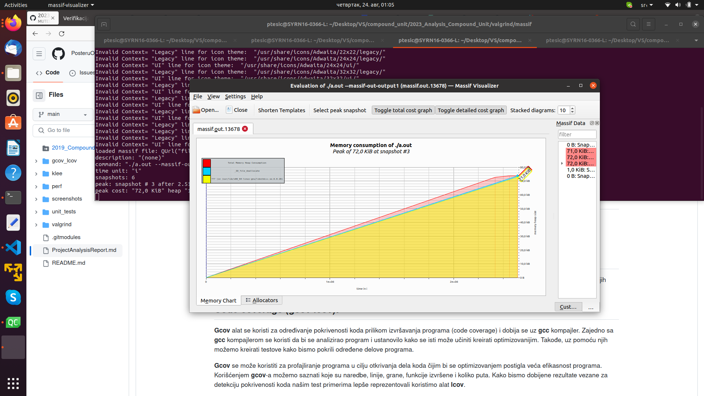
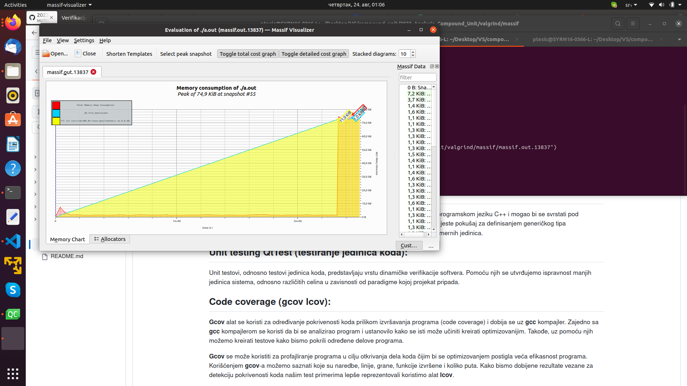
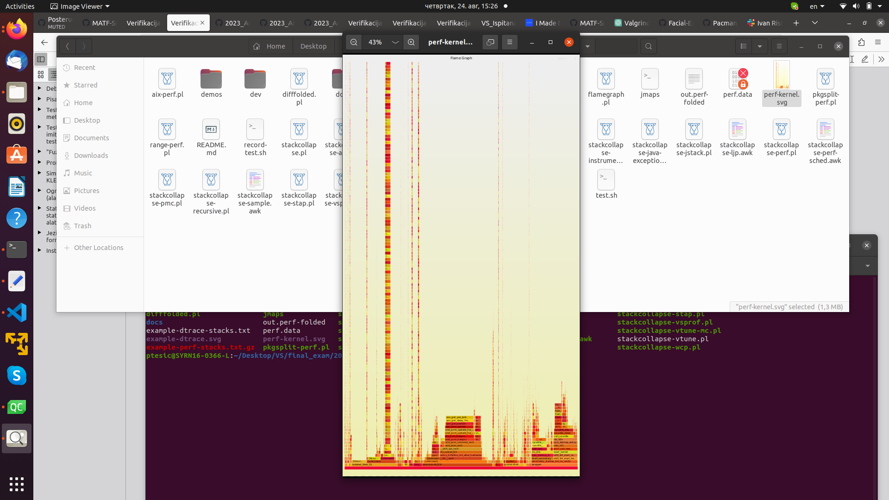
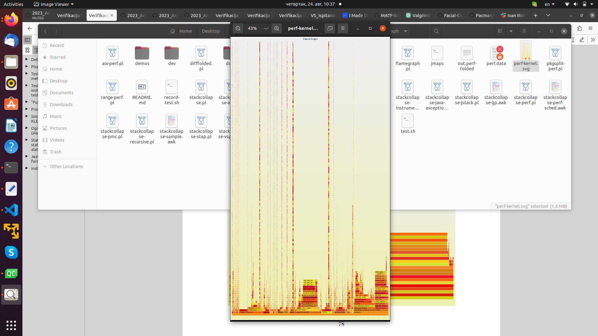

# Izveštaj analize projekta

## O projektu:
Projekat je urađen za potrebe kursa Programske paradigme.
Projekat je napisan u programskom jeziku C++ i mogao bi se svrstati pod funkcionalnu i generičku programsku paradigmu.
Osnovna ideja iza samog projekta jeste pokušaj za definisanjem generičkog tipa "compound_unit" (složena jedinica) koji bi bio korišćen za reprezentovanje različitih mernih jedinica.

## Unit testing QtTest (testiranje jedinica koda):
Unit testovi, odnosno testovi jedinica koda, predstavljaju vrstu dinamičke verifikacije softvera. Pomoću njih se utvrđujemo ispravnost manjih jedinica sistema, odnosno različitih celina u zavisnosti od paradigme kojoj projekat pripada.

## Code coverage (gcov lcov):
**Gcov** alat se koristi za određivanje pokrivenosti koda prilikom izvršavanja programa (code coverage) i dobija se uz **gcc** kompajler. 
Zajedno sa **gcc** kompajlerom se koristi da bi se analizirao program i ustanovilo kako se isti može učiniti kreirati optimizovanijim. Takođe, uz pomoću njih možemo kreirati testove kako bismo pokrili određene delove programa.

**Gcov** se može koristiti za profajliranje programa u cilju otkrivanja dela koda čijim bi se optimizovanjem postigla veća efikasnost programa. Korišćenjem **gcov**-a možemo saznati 
koje su naredbe, linije, grane, funkcije izvršene i koliko puta. Kako bismo dobijene rezultate vezane za detekciju pokrivenosti koda našim test primerima lepše reprezentovali koristimo alat **lcov**.

-Kratak pregled izgenerisanih .html stranica:



## Valgrind - memcheck:
- **Valgrind** je platforma otvorenog koda za kreiranje alata sposobnih za naprednu dinamičku analizu mašinskog koda (bilo povezanog bilo nepovezanog). **Valgrind** obuhvata nekoliko alata od kojih je svaki specijalizovan za detektovanje određenog problema.
- Prvi od **Valgrind**-ovih alata primenjenih nad projektom **compound unit** bio je **memcheck**.
- **Memcheck** kao alat koji si prilikom korišćenja **Valgrind**-a podrazumevano poziva, koristi se za detektovanje memorijskih grešaka i sprovođenja analize nad mašinskim kodom. Može se koristiti za otkrivanje više vrsta problema poput:
    - pristupanja ili upisivanje vrednosti van opsega;
    - pristupanja već oslobođenoj memoriji;
    - curenja memorije;
    - korišćenja neinicijalizovanih vrednosti...
Projekat je izgrađen pomoću komande:
```
g++ -std=c++17 -g -O0 -Wall ../../../2019_Compound-Units-master/demo.cpp -o test 
```
**Memcheck** alat je pokrenut na sledeći naćin:
```
valgrind --tool=memcheck --show-leak-kinds=all --leak-check=full --track-origins=yes ./test
```
Prilikom pokretanja alata memcheck jedan od izveštaja bio je sledeći:
```
==15262== Memcheck, a memory error detector
==15262== Copyright (C) 2002-2017, and GNU GPL'd, by Julian Seward et al.
==15262== Using Valgrind-3.15.0 and LibVEX; rerun with -h for copyright info
==15262== Command: ./test
==15262== 
Acceleration:
m^1s^-2

Merged two compound_units:
s^2s^3m^1s^-2

Condensing the two merged ones:
s^3m^1

Multiplying two compound_units:
m^5s^-3

Dividing two compound_units:
m^1s^-2

Dividing again two compound_units:
m^1s^0

Removing degrees that are equal to zero:
m^1

Unfolding a nested compound_unit:
m^2m^6s^-4m^-8

Formating the unfolded compound_unit:
s^-4

==15262== 
==15262== HEAP SUMMARY:
==15262==     in use at exit: 0 bytes in 0 blocks
==15262==   total heap usage: 2 allocs, 2 frees, 73,728 bytes allocated
==15262== 
==15262== All heap blocks were freed -- no leaks are possible
==15262== 
==15262== For lists of detected and suppressed errors, rerun with: -s
==15262== ERROR SUMMARY: 0 errors from 0 contexts (suppressed: 0 from 0)
```

## Valgrind - massif:
Naredni alat koji je korišćen za analizu projekta je Valgrind-ov podalat - massif, alat za analizu hip memorije iliti profajler hip memorije. 
Massif se koristi za vođenje evidencije o bajtovima o upotrebi, beleženje iskoriščenog prostora, samim tim i otkrivanje nekorišćenih objekata i promenljivih  i u druge svrhe. 
Omogućava nam i merenje zauzeća stek memorije, ali to radi isključivo uz uključivanje opcije (--stacks=yes), jer ta opcija dosta usporava rad alata.

### Massif Visualiser - visualizer for Valgrind Massif memory-usage tracking tool
**Massif Visualizer** je alat koji vizualizuje podatke izgenerisane od strane **massif** alata. Prvo pokrenemo projekat uz pomoć **Valgrind**-a korišćenjem opcije --tool=massif, a onda massif.out.PID fajlove prosledimo **massif-visualizer**-u.Gzip i Bzip2 kompresovani massif fajlovi takođe mogu biti otvoreni pomoću **massif-visualizer**-a.
Rezultate koje smo dobili izgledaju ovako:




## Valgrind - callgrind:
**Callgrind** je alat koji u vidu grafa generiše listu poziva funkcija korisničkog programa.
Pri osnovnim podešavanjima sakupljeni podaci sastoje se od broja izvršenih instrukcija, njihovog odnosa sa linijom u izvršnom kodu, odnosa između pozivajućih i pozvanih funkcija, kao i broja takvih poziva.

Nakon završetka rada programa i **Callgrind** alata podaci koji se analiziraju su zapisani u datoteci callgrind.out.PID , gde PID predstavlja identifikator procesa. Program 
**callgrind_annotate** na osnovu generisanog izveštaja prikazuje listu funkcija. Za grafičku vizuelizaciju preporučeno je koristiti alate poput **KCachegrind**, koji olakšava 
navigaciju ukoliko **Callgrind** napravi veliku količinu podataka. Program **callgrind_control** omogućava interaktivnu kontrolu i nadgledanje programa prilikom izvršavanja. Moguće je 
dobiti i informacije o stanju na steku, a može se, takođe, u svakom trenutku generisati profil.

## Perf
**Perf** (performance analysis tools for Linux) je alat za profajliranje koji pruža jednostavan interfejs preko komandne linije. **Perf** je zasnovan na **perf_events** interfejsu 
koji daju novije verzije Linux kernela. Upotrebljava se na sledeći način:
```
perf [--version] [--help] [OPTIONS] COMMAND [ARGS]
```
Neke komande mogu da budu nedostupne pošto zahtevaju specijalnu kernel podršku.

Za vizuelizaciju podataka dobijenih naredbom **perf report** koristićemo vatreni grafik (flame graph). Grafik prikazuje populaciju uzoraka na x osi, a dubinu steka na z osi. Svaka funkcija je jedan pravougaonik, širine proporcionalne broju uzoraka. Vatreni grafik/dijagram možemo dobiti korišćenjem **perf script** komande na sledeći način: 
```
$ git clone https://github.com/brendangregg/FlameGraph
$ cd FlameGraph
$ sudo perf record -F 99 -ag -- sleep 60
$ perf script | ./stackcollapse-perf.pl > out.perf-folded
$ cat out.perf-folded | ./flamegraph.pl > perf-kernel.svg
```
Primer vatrenog grafika koji testiranjem projekta comound unit izgenerisan je prikazan u nastavku:



## Zaključci:
U projektu nisu pronađeni veći propusti. Projekat je po obimu mali. Implementirano je dosta funkcionalnosti u .hpp fajlovima, ali je mali broj njih testiran u demo.cpp fajlu u kome se nalazi main funkcija.     
